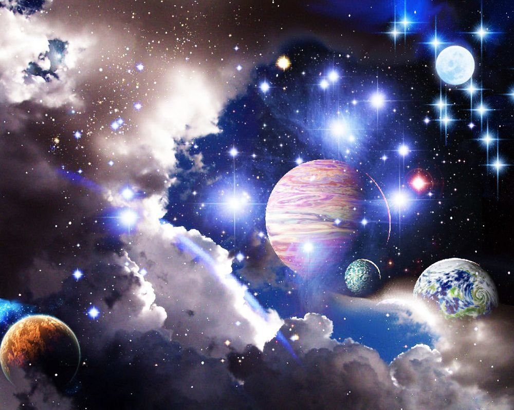

# Earth leadership
In earth leadership, everyone and everything has significance and
a role for earth resilience and sustainable development.
Earth leadership is also being mindful of the challenges around.
The challenges around are the cause to strive for the emergence of
earth leaders. Earth leaders resolve the challenges for which they
have vision and goals.
Earth leaders lead a group of people or organizations towards
the sustainability of the earth.
Earth leaders strive for the emergence of earth leaders for earth
leadership.
Consistent earth leadership is needed, to understand and participate in the processes for positive change. One should be
sensitive and should be the means and cause of earth resources
sustainability.

Consciousness of space and being - ones realisation that I am
almost nothing in the universe, but could be meaningful on this
earth is the earth leadership
# Earth leader
Everyone is an earth leader. An earth leader inspires and empowers
everyone around for earth stewardship. Earth Stewardship is
being responsible and committed to earth sustainability. Earth
leaders are all those who are committed to ecosystem resilience
and sustainable development of the earth.
Earth stewardship it encompasses Environmental stewardship
it refers to responsible use and protection of the natural environment through conservation and sustainable practices.
Earth leader is the trustee for conserving, protecting and improving the earth resources.
Earth Leader is one among the leaders who strive to achieve
common goals.
Earth leaders contemplate on the challenges faced by the earth.
The well being and harmony of the whole world is their ultimate
goal.
They get subjected to the challenges of the world – get sensitised
through awareness, exposure, experience, struggle and experience.
Earth leaders constantly improve their human traits of compassion, love, empathy and humbleness.
Earth leaders reinforce their commitments by practising what
is preached.
They have relevant skills, knowledge and technologies for shaping a resilient future.
An earth leader undergoes all kinds of situations with grace.
There is nothing good nor bad, everything is a situation. For
a leader there will be a definite change in the journey aspired
towards a higher goal.
Earth Leaders don’t get disheartened at failures. They don’t
ever long for respect nor recognition for their contributions and
achievements.
They do remarkable and magnanimous things for earth sustainability.
The earth leaders lead a complete and purposeful life.

